# ZhihuRec 数据分析报告（V1 配套）

## 1. 数据集概况

来源：清华大学 THUIR ZhihuRec 1M dataset。当前本地 raw split 已通过 `data/zhihurec_1m/meta/check.txt` 校验，8 张原始表齐全。

| 表 | 行数 | 说明 |
|---|---:|---|
| `inter_impression.csv` | 999,970 | feed 曝光与点击日志 |
| `inter_query.csv` | 38,422 | 用户搜索 query 日志 |
| `info_user.csv` | 7,974 | 用户侧属性 |
| `info_answer.csv` | 81,563 | 回答内容与互动统计 |
| `info_question.csv` | 29,340 | 问题内容与互动统计 |
| `info_author.csv` | 47,888 | 作者属性 |
| `info_topic.csv` | 22,897 | topic ID 空间 |
| `info_token.csv` | 249,586 | token 向量 |

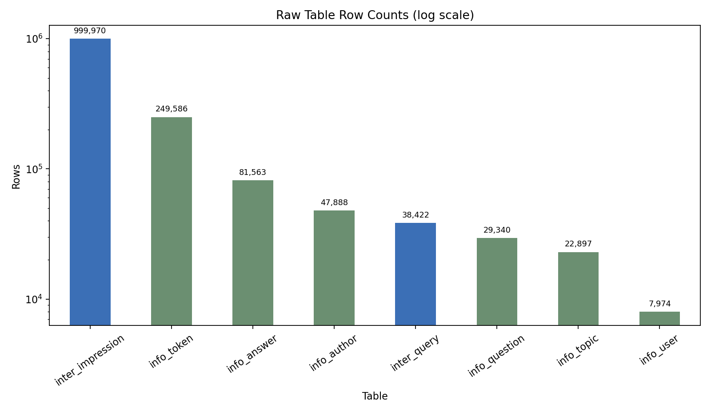

互动日志时间窗口为 **2018-05-02 到 2018-05-13（UTC）**；忽略缺失用的 0 timestamp 后，内容创建时间跨度更长，为 **2010-12-19 到 2018-05-12（UTC）**。这说明 raw 数据不是一个纯静态内容库，而是内容历史与短期曝光/search 行为的组合。

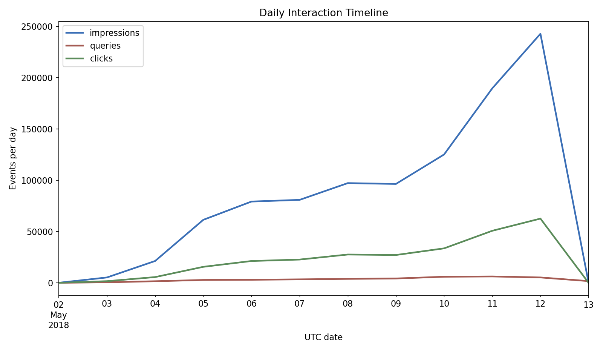

结论：V1 需要同时处理两类信号。一类是内容侧长期属性（answer/question/topic），另一类是短窗口行为（impression/query/click）。这正好对应当前工程设计中“离线 demo world 导入 + 在线 profile 事件更新”的边界。

## 2. 数据规模与稀疏性

原始行为日志包含 **999,970** 条曝光、**268,656** 条点击和 **38,422** 条 query，整体曝光点击率约为 **26.8664%**。有观测行为的用户数为 **7,974**，其中发起过 query 的用户数为 **5,047**，发生过点击的用户数为 **7,974**。

用户侧要分开看：该 1M split 的曝光采样相对均匀，top 1% 用户只贡献 **1.3868%** 的“曝光 + query”观测行为；但主动 query 更稀疏，top 1% 用户贡献 **4.1643%** 的 query。用户 query 数的中位数 / P90 / P99 分别为 **2 / 16 / 20**。

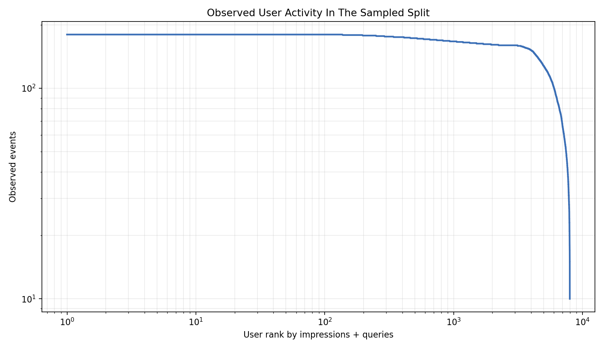

内容侧同样长尾：**81,563** 个 answer 至少被曝光一次，**31,729** 个 answer 至少被点击一次；top 1% answer 拿到了 **25.8707%** 的曝光。answer 曝光数的中位数 / P90 / P99 分别为 **1 / 26 / 198**。

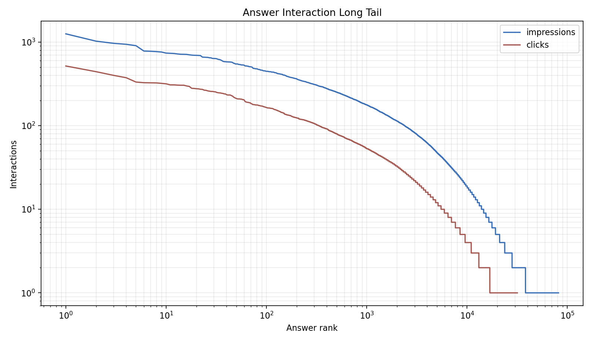

如果把 `user_id × answer_id` 看作用户-内容交互矩阵，全集可能位置为 **650,383,362**，实际出现过曝光的位置为 **981,242**，密度只有 **0.1509%**，也就是 **99.8491%** 的位置没有观测曝光。

结论：用户-内容矩阵天然稀疏，内容曝光明显长尾；即便用户侧曝光被采样得较均匀，主动 search 行为仍比被动 feed 曝光更稀疏。V1 中保留 hot/fresh fallback、topic-based 轻召回和 cold-start 默认画像混合是合理的工程取舍。

## 3. Topic 空间观察

全集共有 **22,897** 个 topic ID。回答侧包含 **250,369** 条 answer-topic 关系，问题侧包含 **85,018** 条 question-topic 关系。至少出现在 answer 侧的 topic 有 **14,158** 个，至少出现在 question 侧的 topic 有 **14,135** 个。

这里用 answer 的曝光次数给其 topic 加权：如果一个 answer 有多个 topic，每个 topic 都继承这条 answer 的曝光权重。因此下面的图表示 topic-weighted exposure，不等同于唯一曝光数。按这个口径，曝光最高的 topic 是 **Topic 46**，加权曝光为 **45,249**；top 100 topic 覆盖了 **29.7463%** 的加权 topic 曝光。

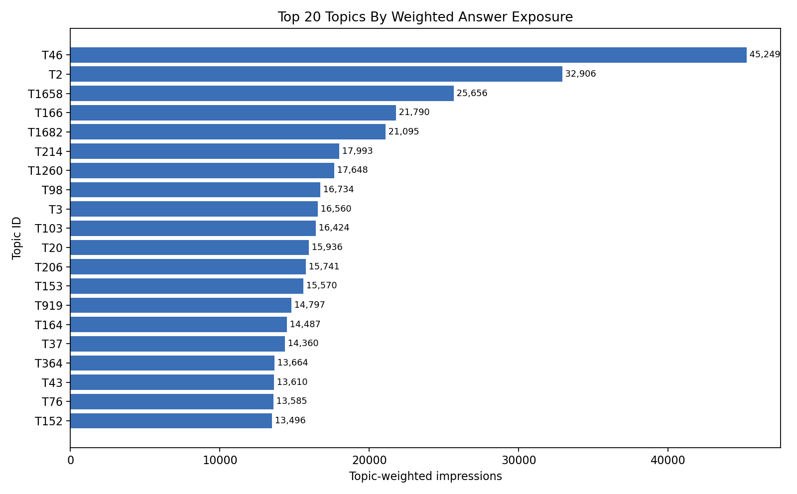

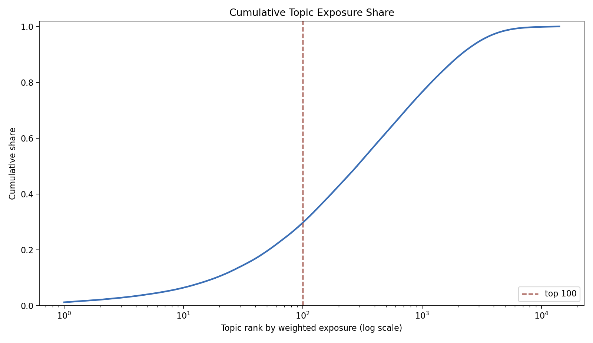

前 50 个高曝光 topic 的共现图显示，topic 不是孤立 ID：同一个 answer/question 往往绑定多个 topic，因此可以形成局部簇。V1 用 topic 作为召回 seed、reranking feature 和 query-topic bridge，是一个低成本但有数据基础的中间表示。

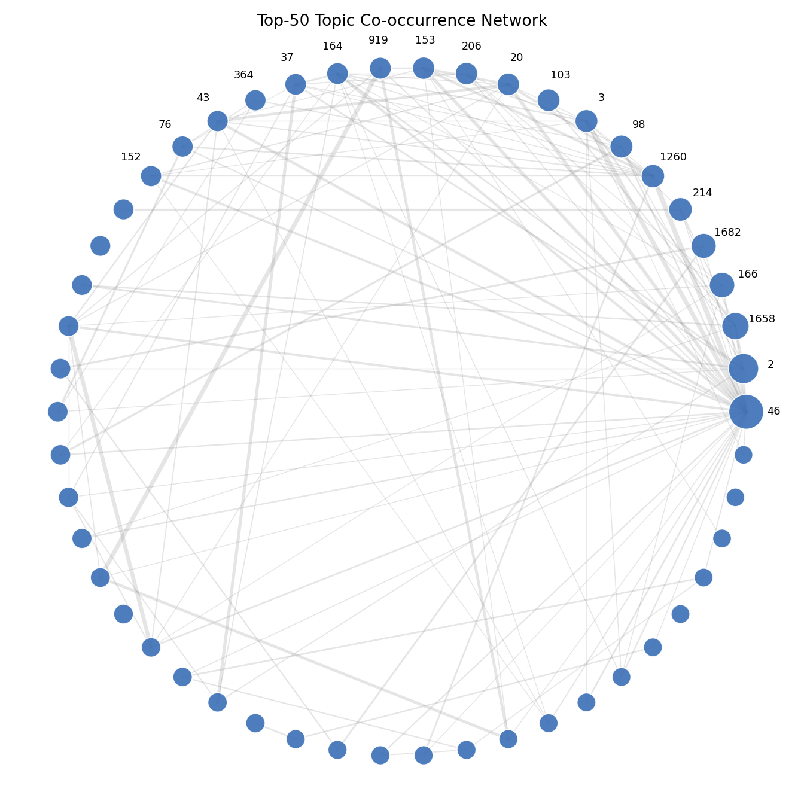

结论：topic 空间既有明显集中度，也有共现结构。它不提供自然语言语义标签，但足够支撑 V1 的轻量召回、搜索意图映射和 cold-start profile blending。

## 4. Query 行为观察（搜索故事 hook 的数据基础）

原始 `inter_query.csv` 包含 **38,422** 条 query 日志，覆盖 **5,047** 个用户。query token 数的中位数 / P90 / P99 分别为 **2 / 4 / 8**，说明大多数 query 很短，适合先用 token/topic 级 bridge，而不是直接做复杂 query 理解。

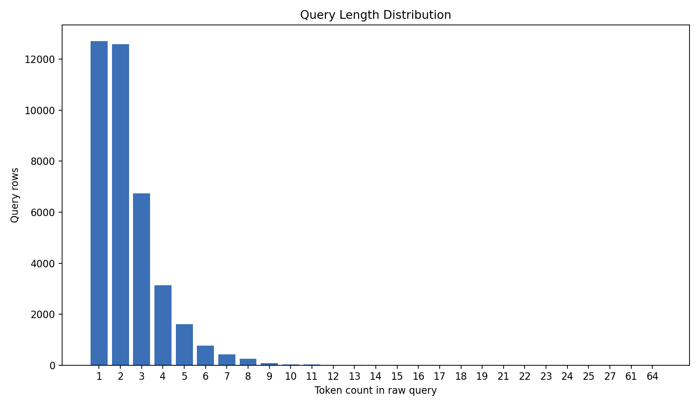

demo bridge 的 `query_topic_map.jsonl` 覆盖 **5,000** 个 query key，其中 **100.0000%** 至少命中 1 个 topic；每个 query key 的 topic 命中数中位数 / P90 / P99 为 **5 / 5 / 5**。

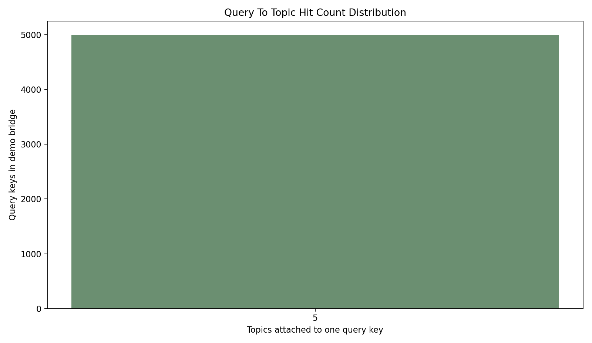

从“feed 浏览后切 search”的角度看，**35.4667%** 的 query 在同用户前 10 分钟内有 feed 曝光，**49.5029%** 的 query 在前 60 分钟内有 feed 曝光。这给 brief §1 的故事 hook 一个数据基础：search 经常不是孤立发生，而是接在 feed 浏览之后。

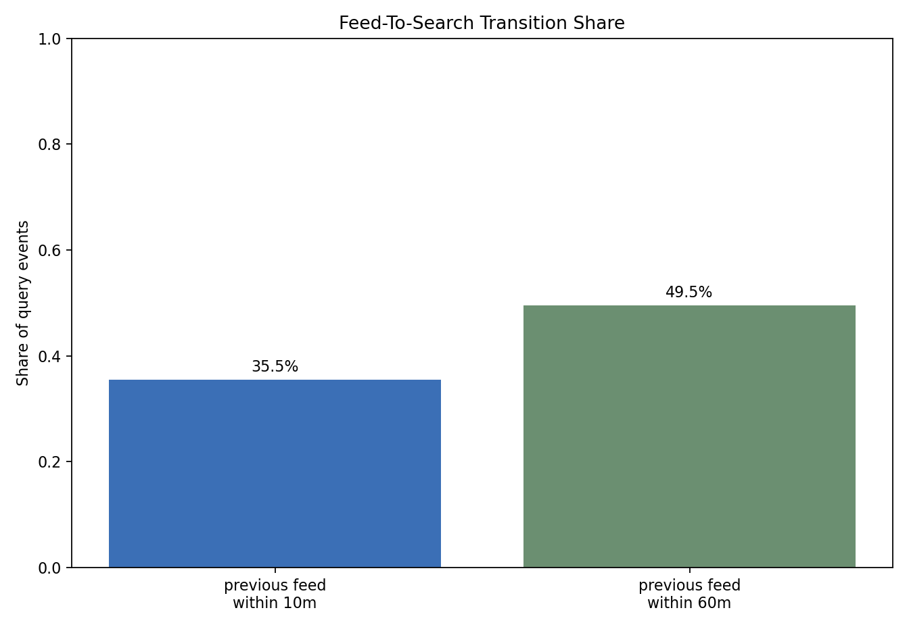

search 后点击只能用 timestamp window 做启发式估计，不能当成真实搜索结果归因。按“query 后 4 小时内同用户出现点击”口径，**39.6466%** 的 query 后续能观察到点击。V1 的 replay 事件流也显式覆盖三类场景：recommendation_click=80、search_query=20、search_result_click=21。

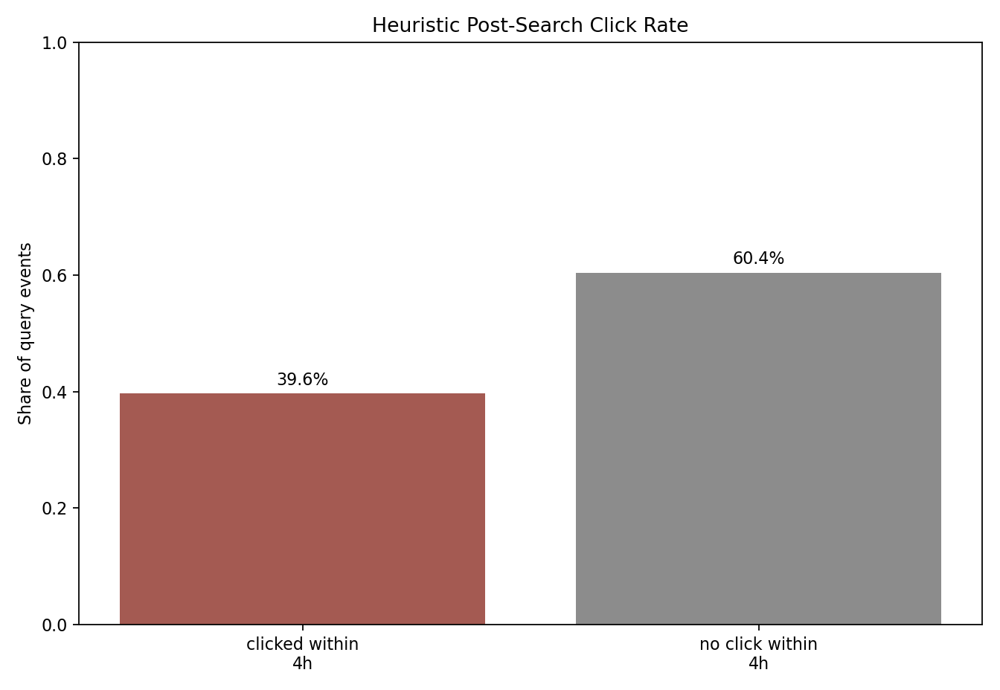

结论：raw 数据支持“feed→search”不是纯想象；demo bridge 又能把 query 映射到 topic，并把 search query / search click 写入 replay。它们共同支撑 V1 的核心链路：search 作为高意图信号，反哺后续 feed 推荐。

## 5. Demo World 子集说明

V1 不直接把完整 raw 数据暴露给前端，而是围绕 demo user **7248** 构建一个可本地运行的小世界。当前 demo world 包含 **2,000** 个 answer、**1,238** 个 question、**1,595** 个 author、**2,552** 个 topic、**5,000** 个 query key、**200** 条 hot fallback snapshot，以及 **121** 条 replay event。

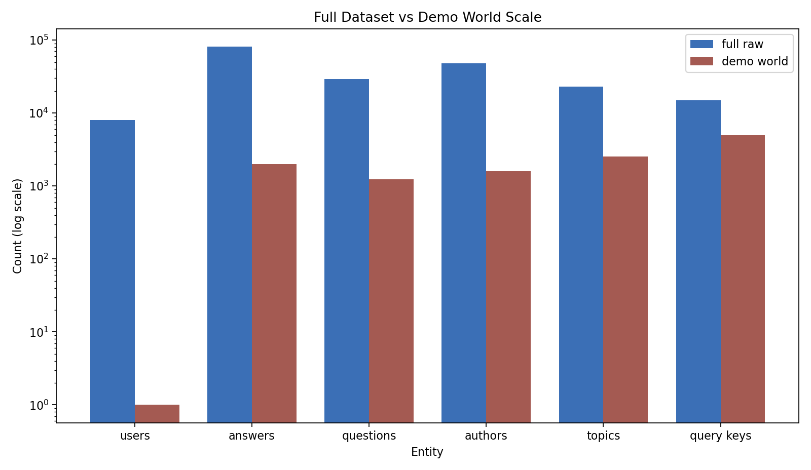

| 维度 | 全集 | demo world | demo / 全集 |
|---|---:|---:|---:|
| users | 7,974 | 1 | 0.0125% |
| answers | 81,563 | 2,000 | 2.4521% |
| questions | 29,340 | 1,238 | 4.2195% |
| authors | 47,888 | 1,595 | 3.3307% |
| topics | 22,897 | 2,552 | 11.1456% |
| query keys | 14,964 | 5,000 | 33.4135% |

这个子集不是为了做离线评测的代表性采样，而是为了支持本地可演示闭环：一个固定用户、足够多的候选内容、可解释 topic bridge、hot fallback 和可回放事件流。`build/demo_world/manifest.json` 也明确记录了 display text 是合成字段，因为 ZhihuRec raw split 不提供真实文本。

## 6. 给系统设计的启示

1. **稀疏矩阵要求 fallback**：用户-内容矩阵密度只有 **0.1509%**，内容曝光又明显长尾（top 1% answer 拿到 **25.8707%** 的曝光）。所以 V1 保留 hot/fresh fallback，而不是完全依赖个性化历史。

2. **Topic 是低成本中间表示**：top 100 topic 覆盖 **29.7463%** 的加权 topic 曝光，并且前 50 高曝光 topic 有明显共现关系。V1 用 topic 做召回 seed、reranking score、query-topic bridge 和 cold-start profile blending，和数据形状一致。

3. **Feed→Search hook 有行为基础**：**35.4667%** 的 query 在同用户前 10 分钟内有 feed 曝光，**39.6466%** 的 query 后 4 小时内可观察到启发式点击。它不能证明 causal lift，但足够支持 brief §1 的工程叙事：search 是高意图信号，应该进入后续推荐画像。

4. **指标闭环已经对上工程实现**：`docs/v1_metrics.md` 的 Search Carryover Gain@10 把这个故事落到可复现数字：当前 replay baseline 0.9000、replay 1.0000、Gain@10 = +0.1000。C1 的数据分析解释“为什么这个信号值得建”，metrics 文档解释“建完后是否真的传导到 feed”。

## 7. 复现指南

运行完整 C1 报告生成：

```powershell
& 'C:\ProgramData\anaconda3\python.exe' scripts\eda.py
```

也可以分段运行：

```powershell
& 'C:\ProgramData\anaconda3\python.exe' scripts\eda.py --sections overview
& 'C:\ProgramData\anaconda3\python.exe' scripts\eda.py --sections topic
& 'C:\ProgramData\anaconda3\python.exe' scripts\eda.py --sections query
& 'C:\ProgramData\anaconda3\python.exe' scripts\eda.py --sections demo
```

输出文件：

- `docs/data_analysis_report.md`
- `docs/figs/01_raw_table_rows.png` 到 `docs/figs/12_demo_world_scale_comparison.png`
- `docs/figs/eda_summary.json`

运行环境：当前 Anaconda Python，依赖 `pandas` 与 `matplotlib`。脚本只读取 `data/zhihurec_1m/raw/` 和 `build/demo_world/manifest.json` / JSONL 文件，不启动 MySQL、不调用 FastAPI、不改 raw 数据、不重建 `build/demo_world/`。
